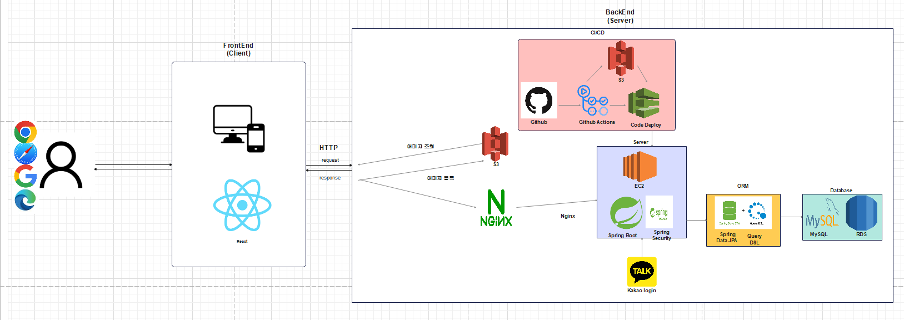

# Be a Clubber

> 숭실대학교 통합 동아리 플랫폼 클러버 • <b>백엔드</b> 레포지토리

## 📚 사용 스택

 

	

## 아키텍쳐 

## 개발 과정
- [Java Enum 활용 프로젝트 개선기 (1)](https://minjun98.tistory.com/108)
- [Java Enum 활용 프로젝트 개선기 (2)](https://minjun98.tistory.com/109)
- [JPA 상속 매핑에 대한 고찰](https://minjun98.tistory.com/106)
